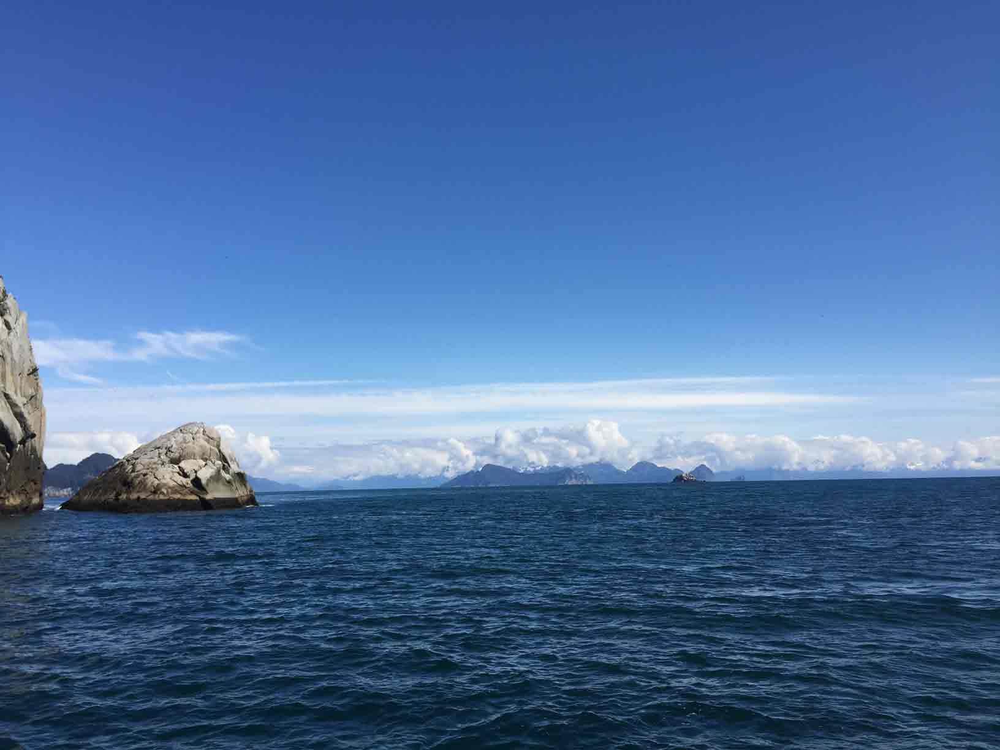
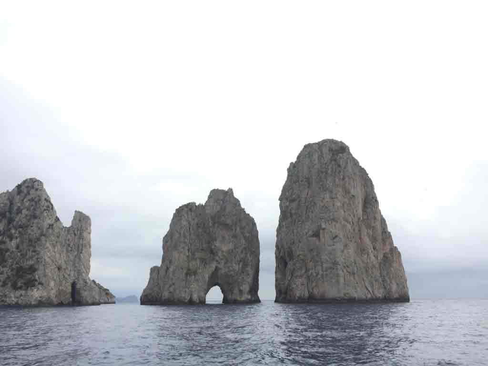

# World Travels  
A way to tell a story of world travels, in map form! :earth_americas:

## Highlights
### Alaska  
   
**_May 21st-30th, 2015_**  
 _Anchorage, Talkeetna, Denali, Seward, Homer, and more!_    

### Italia  
   
**_April 11th-24th, 2016_**  
_Roma, Città del Vaticano, Firenze, Venezia, Pompei, Sorrento, and Capri!_  

## Enhancement Considerations  
* Tell a story!  
* Connect markers with progressive trip timeline.
* Navigate to places on a map (aka a "story map").
* Slideshow gallery in tooltip, showing multiple photos    
* Calculate the distance between markers  
